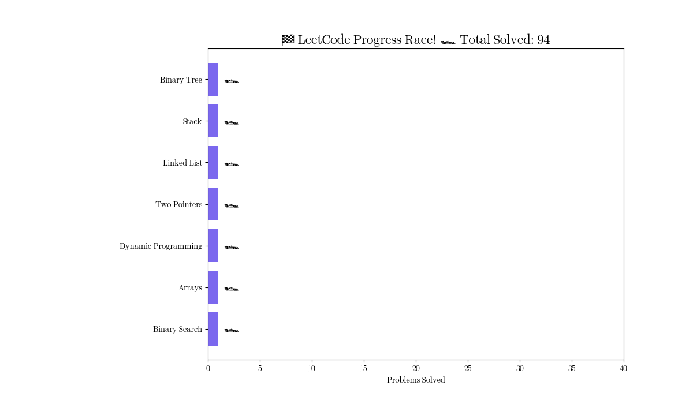

<h1 align="center">
  
</h1>

<p align="center">
  
</p>

<p align="center">
  <a href="https://leetcode.com/u/Mrinal1918" target="_blank">
    
  </a>
  
  
  
</p>

---

## ✨ About This Repository

Welcome to my **LeetCode Solutions Repository**!  
This repo tracks my journey solving algorithm and data structure problems across different topics to prepare for coding interviews and improve my skills.

📌 **Why I'm Doing This:**

- 🧠 Sharpen problem-solving skills  
- 💼 Crack coding interviews  
- 🔁 Build daily consistency  
- 🧩 Master popular DSA patterns  

---

## 📂 Folder Structure

```bash
📁 root/
├── binary-search/
│   └── find-first-and-last-position.py
├── arrays/
│   └── two-sum.py
├── dynamic-programming/
│   └── climb-stairs.py
├── linked-list/
│   └── reverse-linked-list.py
├── binary-tree/
│   └── same-tree.py
...
````

---
## 📁 Problem Categories & Progress

### 🟦 1. Binary Search (12 Problems)

* Find First and Last Position of Element in Sorted Array
* Find Smallest Letter Greater Than Target
* Binary Search
* Search Insert Position
* Sqrt(x)
* Search a 2D Matrix
* Koko Eating Bananas
* Capacity To Ship Packages Within D Days
* Search in Rotated Sorted Array
* Search in Rotated Sorted Array II
* Time Based Key-Value Store
* Peak Index in a Mountain Array

---

### 🟨 2. Arrays (35 Problems)

* Concatenation of Array
* Contains Duplicate
* Valid Anagram
* Two Sum
* Longest Common Prefix
* Remove Element
* Majority Element
* Design HashSet
* Design HashMap
* Group Anagrams
* Find the Duplicate Number
* Kth Smallest Element in a Sorted Matrix
* Missing Number
* Find All Numbers Disappeared in an Array
* Single Number (Bit Manipulation)
* Convert 1D Array Into 2D Array
* Products of Array Except Self
* Sort an Array
* Sort Colors
* Meeting Rooms
* Maximum Average Subarray I
* Find All Duplicates in an Array
* Set Matrix Zeroes
* Spiral Matrix
* Rotate Image
* Word Search
* Longest Consecutive Sequence
* Subsets
* Subsets II
* Permutations
* Permutations II
* Combinations
* Maximum Subarray
* Combination Sum
* Merge Intervals

---

### 🟥 3. Dynamic Programming (19 Problems)

* Fibonacci Number
* N-th Tribonacci Number
* Coin Change
* Climbing Stairs
* Range Sum Query - Immutable
* Range Sum Query 2D Immutable
* Pascal's Triangle
* Counting Bits
* Pascal's Triangle II
* Min Cost Climbing Stairs
* Best Time to Buy and Sell Stock
* Divisor Game
* Maximum Repeating Substring
* Jump Game
* Target Sum
* House Robber
* House Robber II
* Maximum Product Subarray
* Word Break

---

### 🟧 4. Two Pointers (8 Problems)

* Reverse String
* Valid Palindrome
* Valid Palindrome II
* Is Subsequence
* Squares of a Sorted Array
* Backspace String Compare
* Move Zeroes
* Longest Palindromic Substring

---

### 🟫 5. Linked List (10 Problems)

* Add Two Numbers
* Linked List Cycle
* Middle of the Linked List
* Reverse Linked List
* Palindrome Linked List
* Remove Linked List Elements
* Remove Duplicates from Sorted List
* Merge Two Sorted Lists
* Swap Nodes in Pairs
* Reverse Linked List II

---

### 📦 6. Stack (1 Problem)

* Evaluate Reverse Polish Notation

---

### 🌳 7. Binary Tree (9 Problems)

* Binary Tree Inorder Traversal
* Binary Tree Preorder Traversal
* Binary Tree Postorder Traversal
* Same Tree
* Path Sum
* Diameter of Binary Tree
* Merge Two Binary Trees
* Invert Binary Tree
* Subtree of Another Tree

---

## 🧠 

| Category            | Icon | Problems Solved |
| ------------------- | ---- | --------------- |
| Binary Search       | 🟦   | 12              |
| Arrays              | 🟨   | 35              |
| Dynamic Programming | 🟥   | 18              |
| Two Pointers        | 🟧   | 8               |
| Linked List         | 🟫   | 10              |
| Stack               | 📦   | 1               |
| Binary Tree         | 🌳   | 9               |
| **Total**           | 🔢   | **93** 🎯       |

---

<p align="center">
  
</p>

## 🚀 Goals & Milestones

* ✅ **100 Problems in 100 Days**
* 🔁 **Daily Problem Solving Routine**
* 🧠 **Master Common Patterns**
  (Binary Search, DP, Two Pointers, Trees)
* 🧾 **Write clean, documented code with test cases**

---

## 🌟 How to Use This Repo

1. 📂 Browse by category folder
2. 🧠 Read the solution & explanation
3. 🧪 Try to solve it yourself
4. 💬 Use comments for deeper understanding
5. ⭐ Star this repo if it helped you!

---

## 📈 GitHub Contribution Graph

<p align="center">
  
</p>

---

> 🧘 *"Consistency beats intensity."*
> Let's improve one problem at a time!

<p align="center">
  
</p>
```

